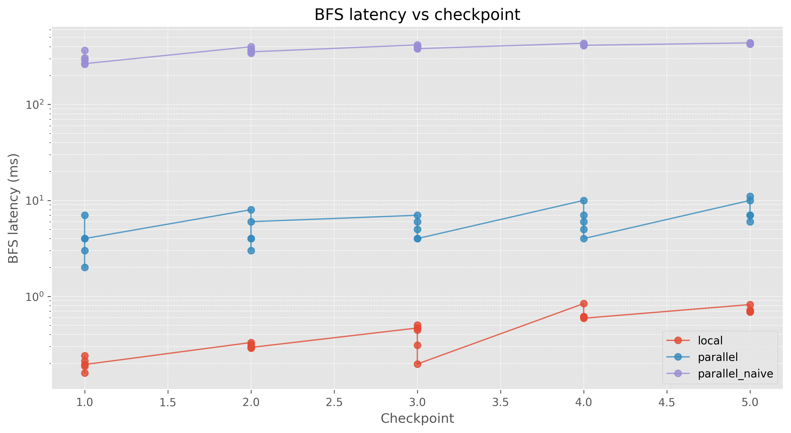
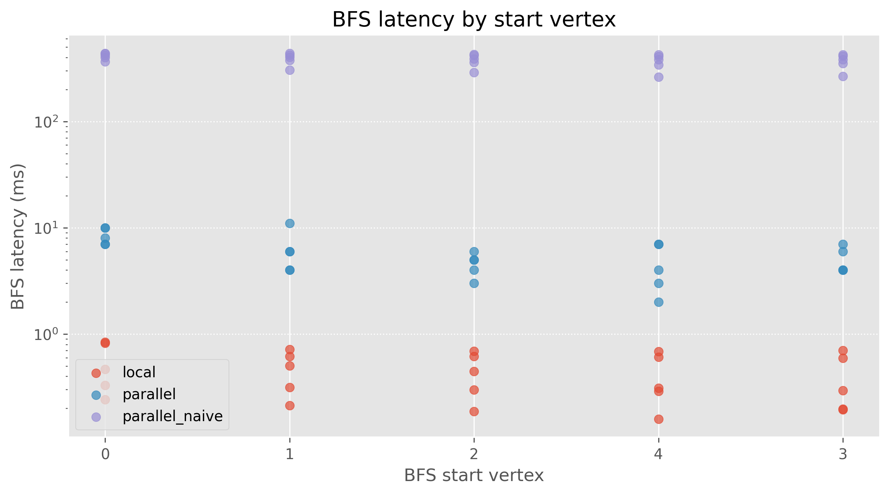

# Milestone 3

This milestone focused on two main deliverables: (1) an optimized distributed BFS implementation that uses shard-to-shard communication to reduce latency and improve scalability, and (2) a comprehensive benchmarking client that evaluates BFS performance by comparing the distributed implementation against a local baseline across multiple checkpoints.

## Overview

The optimized BFS uses a distributed, shard-to-shard communication pattern where shards coordinate directly with each other, reducing the Query Manager's (QM) role to initialization and result aggregation.

## Naive BFS Implementation

Before implementing the optimized version, the system used a simple sequential BFS approach (`pkg/qm/query_manager.go:naiveBFS`). This implementation:

**How it works**:
1. Maintains a queue of vertices to process, starting with the start vertex
2. Processes vertices **sequentially** one at a time
3. For each vertex:
   - Extracts the shard ID from the vertex ID
   - Makes a **synchronous RPC call** to the shard to get neighbors
   - Adds unvisited neighbors to the queue with incremented level
4. Continues until the queue is empty or the radius limit is reached

**Limitations**:
- **Sequential processing**: Each vertex is processed one at a time, blocking on each RPC call
- **No parallelism**: Cannot explore multiple vertices simultaneously across different shards
- **High latency**: Network round-trips accumulate linearly, resulting in poor performance for large graphs
- **Query Manager bottleneck**: All coordination happens through the QM, which must wait for each shard response before proceeding

The naive implementation serves as a baseline for comparison, demonstrating the performance improvements achieved by the optimized distributed approach.

## Key Components

### Query Manager (QM)
- **Role**: Initiates BFS, tracks completion, aggregates results
- **Key Functions**:
  - `pkg/qm/query_manager.go:distributedBFS` - Orchestrates the BFS request
  - `pkg/qm/query_manager.go:ReceiveBFSResult` - Collects results from shards
  - `pkg/qm/query_manager.go:BFS` - RPC entry point

### Shards
- **Role**: Perform local BFS traversal, coordinate with other shards
- **Key Functions**:
  - `pkg/shard/shard.go:DistributedBFS` - Handles QM-initiated requests
  - `pkg/shard/shard.go:DistributedBFSFromShard` - Handles shard-to-shard requests
  - `pkg/shard/shard.go:performBFS` - Core BFS logic (shared)
  - `pkg/shard/shard.go:callShardBFS` - Async cross-shard communication

## BFS Request Flow

### Step 1: Client Request → QM
**Function**: `pkg/qm/query_manager.go:BFS`

- Client sends BFS request with `StartVertexID`, `Radius`, and `Timestamp`
- QM checks config: if `BFSType == "optimized"`, calls `distributedBFS`

### Step 2: QM Initializes BFS State
**Function**: `pkg/qm/query_manager.go:distributedBFS`

**QM Actions**:
1. Generates unique `RequestID` (format: `bfs-{timestamp}-{random}`)
2. Creates `BFSState` to track:
   - `visited`: map of discovered vertices → levels
   - `pendingShards`: map tracking expected vs received responses per shard
   - `done`: channel to signal completion
3. Extracts shard ID from `StartVertexID` (format: `{shardID}-{randomHex}`)
4. Registers state in `activeBFS` map
5. Initializes pending state for starting shard: `Expected=1, Received=0`

### Step 3: QM → Starting Shard (Synchronous)
**Function**: `pkg/shard/shard.go:DistributedBFS`

**QM sends**:
- `QMToShardBFSRequest` with start vertex (level 0), radius, timestamp, requestID, QM address

**Shard receives and**:
1. Verifies leadership (`raft.VerifyLeader()`)
2. Calls `performBFS` with start vertices

### Step 4: Shard Performs Local BFS
**Function**: `pkg/shard/shard.go:performBFS`

**Shard Actions**:
1. **Deduplication**: Gets or creates `BFSRequestState` for this `RequestID` (prevents processing same request multiple times)
2. **Local BFS Traversal**:
   - Processes vertices in queue with their absolute levels (from original root)
   - For each vertex:
     - Skips if already visited at same or lower level
     - Marks as visited, adds to results
     - If level < radius, gets neighbors
     - For each neighbor:
       - If local (same shard): adds to local queue with `level+1`
       - If cross-shard: groups by target shard with `level+1`
3. **Returns**:
   - `vertices`: local vertices found (with levels)
   - `shardVertices`: map of `shardID → []StartVertex` (vertices to send to each shard)
   - `expectedResponses`: map of `shardID → count` (how many responses to expect from each shard)

### Step 5: Shard → Other Shards (Asynchronous)
**Function**: `pkg/shard/shard.go:DistributedBFS` (lines 757-778)

**Shard Actions**:
1. Returns synchronous response to QM with:
   - Found vertices
   - `ExpectedResponses` array (tells QM how many responses to expect from each target shard)
2. **Asynchronously** sends `ShardToShardBFSRequest` to each target shard via `callShardBFS`
   - Uses connection pooling for efficiency
   - Fire-and-forget (no response expected from target shard)

### Step 6: QM Processes Initial Response
**Function**: `pkg/qm/query_manager.go:ReceiveBFSResult`

**QM Actions**:
1. Looks up `BFSState` by `RequestID`
2. **Merges vertices**: Adds discovered vertices to `visited` map (keeps minimum level if duplicate)
3. **Updates pending counts**:
   - Increments `Received` for responding shard
   - For each `ExpectedResponse`, increments `Expected` for target shards
4. **Checks completion**: If all shards have `Received == Expected`, closes `done` channel

### Step 7: Target Shards Process Cross-Shard Requests
**Function**: `pkg/shard/shard.go:DistributedBFSFromShard`

**Shard receives** `ShardToShardBFSRequest` and:
1. Verifies leadership
2. Calls `performBFS` (same logic as Step 4, reusing deduplication state)
3. **Asynchronously** sends results back to QM via `QueryManager.ReceiveBFSResult` RPC
4. **Asynchronously** forwards requests to other shards if needed

### Step 8: QM Collects All Results
**Function**: `pkg/qm/query_manager.go:ReceiveBFSResult` (called repeatedly)

**QM Actions** (for each async response):
- Same as Step 6: merges vertices, updates pending counts, checks completion

### Step 9: QM Completes and Returns
**Function**: `pkg/qm/query_manager.go:distributedBFS` (lines 701-728)

**QM Actions**:
1. Waits on `done` channel (or 30s timeout)
2. When complete, copies `visited` map to result
3. Cleans up `BFSState` from `activeBFS` map
4. Returns result to client via `BFS` handler

## Key Design Features

### Deduplication
- Each shard maintains `BFSRequestState` per `RequestID` to avoid processing duplicate requests
- QM tracks visited vertices globally to prevent duplicates in final result

### Asynchronous Communication
- Shard-to-shard requests are async (fire-and-forget)
- Shard-to-QM responses are async (except initial synchronous response)
- Reduces latency by not blocking on network calls

### Connection Pooling
- Shards maintain connection pools per target shard (`connectionPool`)
- Pools automatically invalidate when leader changes
- Reduces connection overhead

### Completion Tracking
- QM tracks `Expected` vs `Received` responses per shard
- `Expected` counts are dynamically updated as shards report expected responses from other shards
- BFS completes when all shards have `Received >= Expected`

### Level Tracking
- Each vertex maintains its absolute level from the original root
- Prevents incorrect level assignments in distributed traversal
- Ensures radius limits are correctly enforced

## Example Flow Diagram

```
Client → QM.BFS
         ↓
    QM.distributedBFS (creates RequestID, BFSState)
         ↓
    QM → Shard 0: DistributedBFS (sync)
         ↓
    Shard 0: performBFS
         ├─→ Finds local vertices
         ├─→ Groups cross-shard neighbors
         └─→ Returns: vertices + ExpectedResponses
         ↓
    Shard 0 → QM: ReceiveBFSResult (sync response)
         ↓
    QM: ReceiveBFSResult (updates state)
         ↓
    Shard 0 → Shard 1: DistributedBFSFromShard (async)
    Shard 0 → Shard 2: DistributedBFSFromShard (async)
         ↓
    Shard 1: performBFS → QM: ReceiveBFSResult (async)
    Shard 2: performBFS → QM: ReceiveBFSResult (async)
         ↓
    QM: ReceiveBFSResult (multiple times, updates state)
         ↓
    When all Received == Expected: close(done)
         ↓
    QM.distributedBFS returns result
         ↓
    QM.BFS returns to client
```

## Benchmarking

### Benchmark Architecture

The benchmark suite (`cmd/benchmark/`) evaluates BFS performance by comparing the optimized distributed implementation against a local single-threaded baseline. The benchmark uses a realistic workload pattern with parallel ingestion and periodic query checkpoints.

#### Key Components

**Functions**:
- `cmd/benchmark/main.go:main` - Entry point, orchestrates benchmark execution
- `cmd/benchmark/local.go:buildLocalGraphFromWorkload` - Builds local graph representation
- `cmd/benchmark/local.go:transposeGraph` - Creates transposed graph for PageRank
- `cmd/benchmark/local.go:getTopVerticesByPageRank` - Computes PageRank to select BFS start vertices
- `cmd/benchmark/remote.go:ParallelBenchmarkClient` - Handles parallel distributed benchmark
- `cmd/benchmark/local.go:LocalGraphBenchmark` - Handles local single-threaded benchmark

#### Benchmark Process

1. **Graph Construction** (`cmd/benchmark/local.go:buildLocalGraphFromWorkload`):
   - Parses workload file (edge list format: `from to [weight]`)
   - Builds local in-memory graph representation

2. **BFS Start Vertex Selection** (`cmd/benchmark/local.go:getTopVerticesByPageRank`):
   - Transposes the graph (reverses all edges)
   - Computes PageRank on the transposed graph
   - Selects top V vertices by PageRank score as BFS start vertices
   - **Rationale**: High PageRank in transposed graph indicates vertices with many incoming edges, making them good candidates for exploring graph connectivity

3. **Parallel Ingestion** (`cmd/benchmark/remote.go:ParallelBenchmarkClient.Run`):
   - Uses multiple goroutines (configurable via `-goroutines` flag) to ingest edges in parallel
   - Each goroutine maintains its own RPC connection to the Query Manager
   - Operations are distributed across shards based on vertex ID partitioning
   - Optional rate limiting via token bucket algorithm

4. **Checkpoint-Based Querying** (`cmd/benchmark/remote.go:ParallelBenchmarkClient.runBFSQueries`):
   - Divides workload into N+1 segments (N = number of checkpoints)
   - At each checkpoint position `(i+1) * totalOps / (N+1)`:
     - Pauses new edge ingestion
     - Waits for all pending operations to complete
     - Runs BFS queries from all selected start vertices
     - Records latency measurements for each query
   - Resumes ingestion after queries complete

5. **Local Baseline** (`cmd/benchmark/local.go:LocalGraphBenchmark.Run`):
   - Single-threaded sequential edge ingestion
   - Same checkpoint positions as parallel benchmark
   - Performs local BFS at each checkpoint for comparison

#### Benchmark Command

```bash
go run cmd/benchmark/*.go \
  -config 3_shard_3_replica_config.yaml \
  -workload cmd/client/workloads/large_rmat_copy.txt \
  -goroutines 10 \
  -checkpoints 5 \
  -bfs-radius 10 \
  > logs/benchmark.log 2>&1
```

**Parameters**:
- `-config`: Cluster configuration file
- `-workload`: Graph workload file (edge list)
- `-goroutines`: Number of parallel ingestion threads
- `-checkpoints`: Number of checkpoint intervals
- `-bfs-radius`: Maximum BFS traversal depth
- `-top-vertices`: Number of top PageRank vertices to use as BFS starts (default: 5)

**Output Files**:
- `benchmark_parallel_optimized.json`: Results from distributed optimized BFS
- `benchmark_parallel_naive.json`: Results from distributed naive BFS (if run)
- `benchmark_local.json`: Results from local single-threaded baseline

### Benchmark Results

The benchmark results are analyzed in `notebooks/bfs_performance_comparison.ipynb`, which provides:

#### Correctness Validation

- **Result Matching**: The notebook verifies that BFS results match between local and parallel implementations for all `(checkpoint, bfs_start)` pairs
- **Result Sizes**: Tracks the number of vertices discovered by each BFS query
- **Consistency**: Ensures distributed implementation produces identical results to local baseline

#### Performance Metrics

**Latency Measurements**:
- **RTT (Round-Trip Time)**: End-to-end latency for each BFS query in milliseconds
- **Checkpoint Progression**: Latency trends as graph grows over checkpoints
- **Start Vertex Variation**: Latency differences across different start vertices

**Statistical Summary**:
- Mean, median, min, max latencies per dataset
- Comparison between local, parallel optimized, and parallel naive implementations
- Percentage difference calculations between implementations

#### Visualizations

The notebook (`notebooks/bfs_performance_comparison.ipynb`) generates and saves the following visualizations:

1. **BFS Latency vs Checkpointnotebooks/** (`bfs_latency_vs_checkpoint.png`):
   - Line plot showing BFS latency progression across checkpoints
   - Log scale Y-axis to handle wide latency ranges
   - Separate lines for each dataset (local, parallel optimized, parallel naive)
   - **Insight**: Shows how latency scales as graph size increases
   - 

2. **BFS Latency by Start Vertex** (`notebooks/bfs_latency_by_start_vertex.png`):
   - Scatter plot of latency vs start vertex ID
   - Log scale Y-axis
   - **Insight**: Reveals which vertices produce faster/slower BFS queries (may correlate with vertex degree, shard distribution, etc.)
   - 

3. **Checkpoint Comparison Table** (`notebooks/checkpoint_comparison.csv`):
   <!-- - Pivot table comparing latencies across checkpoints
   - Percentage difference calculations (parallel vs local)
   - **Insight**: Quantifies performance overhead of distributed implementation
   - Saved as CSV for detailed analysis -->

   | Checkpoint | Local (ms) | Parallel Optimized (ms) | Parallel Naive (ms) | Parallel vs Local (%) |
   |------------|------------|-------------------------|---------------------|----------------------|
   | 1          | 0.199      | 4.0                     | 298.0               | 1911.5               |
   | 2          | 0.305      | 5.0                     | 366.0               | 1539.0               |
   | 3          | 0.385      | 5.2                     | 394.2               | 1252.2               |
   | 4          | 0.654      | 6.4                     | 419.0               | 878.6                |
   | 5          | 0.724      | 8.2                     | 431.6               | 1032.6               |

   **Observations**:
   - Optimized parallel implementation shows ~4-8ms latency vs ~0.2-0.7ms for local
   - Parallel naive implementation is significantly slower (~300-430ms)
   - Optimized implementation provides ~50-70x speedup over naive parallel approach
   - Latency increases with checkpoint number as graph grows

#### Key Findings

From the benchmark analysis:

- **Correctness**: Distributed BFS produces identical results to local baseline, validating the implementation
- **Latency Characteristics**: 
  - Parallel implementation shows higher latency due to network overhead and coordination
  - Latency increases with checkpoint number (larger graph = more vertices to traverse)
  - Some start vertices produce consistently faster queries (likely due to local shard distribution)
- **Scalability**: The optimized implementation maintains reasonable latency even as graph size grows across checkpoints

